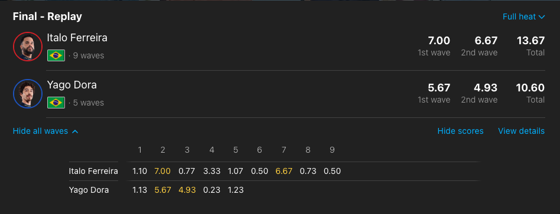
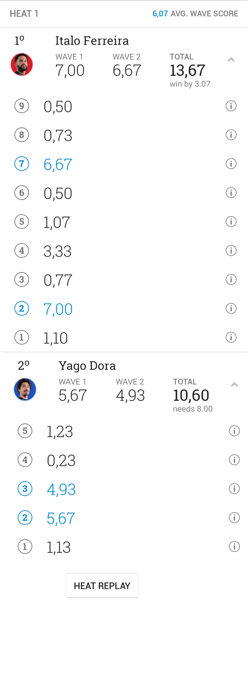
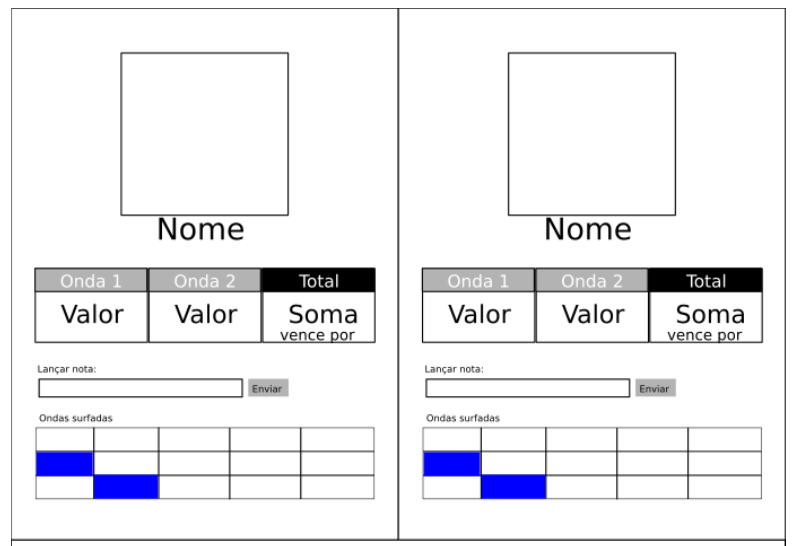

# World Surf League

Você foi contratado para desenvolver o site que mostra as baterias da liga mundial de surf. Nesta telas, os fãs de surf devem ser capazes de acompanhar a pontuação de cada competidor e assim entender o que ele precisa fazer para vencer a bateria.

### Requisitos

1. A página deve mostrar os nomes e foto de cada competidor
2. A página deve mostrar a quantidade de ondas surfadas por cada competidor
	- Um competidor pode surfar uma quantidade ilimitada de ondas
   - Apesar de surfas quantas ondas quiserem, **apenas as duas com maior pontuação são consideradas para calcular a pontuação do surfista na bateria.**
   - **Estas duas ondas devem estar em destaque na lista de ondas surfadas**
3. As duas ondas com maior notas devem ser mostradas ao lado da pontuação do total do surfista na bateria
4. A pontuação total do surfista deve estar sempre atualizada, mostrando por quanto ele esta ganhando ou quanto ele precisa para ganhar 
5. Deve haver um formulário onde um juiz pode enviar a pontuação de uma onda 
  - Neste formulário o juiz escolher o surfista e informa a nota da onda
  - As notas variam de 0 até 10
  - O formulário deve garantir somente a inserção de notas válidas

  
### Bonificação

- Haveá um pontuação extra de até 0.5 ponto para páginas responsivas
- As páginas com boa aparênca também serão bonificadas em 0.5

### Inspirações

